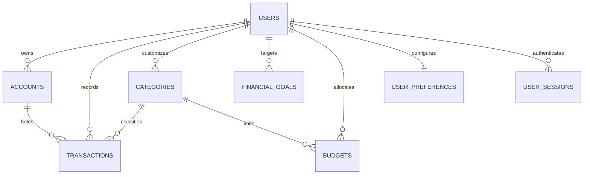

<div align="center">

```
  ██████╗ ███████╗██████╗ ███████╗ ██████╗ ███╗   ██╗ █████╗ ██╗         ██████╗███████╗ ██████╗ 
  ██╔══██╗██╔════╝██╔══██╗██╔════╝██╔═══██╗████╗  ██║██╔══██╗██║        ██╔════╝██╔════╝██╔═══██╗
  ██████╔╝█████╗  ██████╔╝███████╗██║   ██║██╔██╗ ██║███████║██║  █████╗██║     █████╗  ██║   ██║
  ██╔═══╝ ██╔══╝  ██╔══██╗╚════██║██║   ██║██║╚██╗██║██╔══██║██║  ╚════╝██║     ██╔══╝  ██║   ██║
  ██║     ███████╗██║  ██║███████║╚██████╔╝██║ ╚████║██║  ██║███████╗    ╚██████╗██║     ╚██████╔╝
  ╚═╝     ╚══════╝╚═╝  ╚═╝╚══════╝ ╚═════╝ ╚═╝  ╚═══╝╚═╝  ╚═╝╚══════╝     ╚═════╝╚═╝      ╚═════╝ 
```

<p align="center">
  <code>CFO // CORE-KERNEL</code> &nbsp;&nbsp;·&nbsp;&nbsp; <code>DOUBLE-ENTRY / INR</code> &nbsp;&nbsp;·&nbsp;&nbsp; <code>SYSTEM RELEASE 0.3.0</code>
</p>

# AI Personal CFO
### Autonomous Financial Intelligence, Ledger Governance & Cashflow Telemetry

<p align="center">
  
  
  
  
  
  
</p>

<p align="center">
  <b>High-precision financial intelligence engine for individuals and founders.</b><br>
  Guided onboarding setup · Multi-account double-entry ledger · Real-time net worth synthesis · P&L & Balance Sheet generation · Burn & Leak telemetry.
</p>

---

</div>

<br>

## ⚡ Live Telemetry & Build Matrix

```
┌────────────────────────────────────────────────────────────────────────────────────────────────────────┐
│  LIVE SYSTEM STATUS :: ALL CORES ACTIVE                                                [ ◉ TELEMETRY ] │
├───────────────────────────────┬────────────┬─────────────┬─────────────────────────────────────────────┤
│ SUBSYSTEM                     │ STABILITY  │ HEALTH      │ ACTIVE CAPABILITIES                         │
├───────────────────────────────┼────────────┼─────────────┼─────────────────────────────────────────────┤
│ ◈ Authentication & Session    │ 100% LIVE  │ 🟢 RESILIENT │ Dual storage, cross-domain refresh grace    │
│ ◈ Guided Onboarding Workflow  │ 100% LIVE  │ 🟢 RESILIENT │ 5-Step setup: accounts, goals, preferences  │
│ ◈ Ledger & Account Kernel     │ 100% LIVE  │ 🟢 RESILIENT │ Full CRUD, Balance tracking, INR decimal    │
│ ◈ Account Management Hub      │ 100% LIVE  │ 🟢 RESILIENT │ Settings tab & dedicated account panel      │
│ ◈ Dashboard Telemetry         │ 100% LIVE  │ 🟢 RESILIENT │ Net worth, Cashflow 7D-1Y, Burn, Health     │
│ ◈ Budgets & Monthly Limits    │ 100% LIVE  │ 🟢 RESILIENT │ Category caps, Real-time pace, Edit/Delete  │
│ ◈ Goals & Milestone Engine    │ 100% LIVE  │ 🟢 RESILIENT │ Priority goals, Target dates, Edit/Delete   │
│ ◈ Investment & Holdings Hub   │ 100% LIVE  │ 🟢 RESILIENT │ Asset allocation slices, Edit/Delete        │
│ ◈ Debt & Liability Engine     │ 100% LIVE  │ 🟢 RESILIENT │ Loan tracking, Outstanding balance, Actions │
│ ◈ Formal Reports Suite        │ 100% LIVE  │ 🟢 RESILIENT │ P&L, MoM Compare, Tax Audit, Leaks, PDF     │
│ ◈ Settings & Data Portability │ 100% LIVE  │ 🟢 RESILIENT │ Accounts, Category CRUD, CSV/JSON Export    │
│ ◈ Conversational AI CFO       │ 65% QUEUED │ ⚪ IN PROGRESS│ Agent dispatcher & contextual ledger RAG    │
│ ◈ ML Forecasts & Scenarios    │ 40% QUEUED │ ⚪ SCHEDULED  │ Cashflow burn predictive modeling           │
└───────────────────────────────┴────────────┴─────────────┴─────────────────────────────────────────────┘
```

<br>

### 🟢 Module Build Status

| Subsystem | Endpoint / Surface | Build Status | Description |
| :--- | :--- | :---: | :--- |
| **Authentication** | `/api/auth/*` |  | Argon2 password hashing, rotating refresh tokens with 30s grace window, cross-domain body/cookie fallback, zero-flash refresh |
| **Guided Onboarding** | `/onboarding`, `/api/onboarding/*` |  | 5-Step interactive wizard: Account setup, Income baseline, Monthly budget caps, Milestone goals, and Financial preferences |
| **Command Center** | `/dashboard` |  | 7D/30D/3M/6M/1Y cashflow charts, Financial Health score (0-100), net worth delta, instant action prompts |
| **Account Management** | `/settings?tab=accounts`, `/accounts` |  | Manage bank accounts, credit cards, investments, and loans created during or after onboarding |
| **Transactions Engine** | `/transactions` |  | Income, Expense, Transfer, Pending movements, category tagging, account balance auto-adjustment |
| **Budget Control** | `/budgets` |  | Category monthly limit tracking, budget utilization gauges, right-aligned Edit & Delete actions |
| **Goal Tracker** | `/goals` |  | Milestone targets, priority badges, progress bars, interactive Goal Edit and Delete modals |
| **Investments Hub** | `/investments` |  | Portfolio asset breakdown, gain/loss indicators, account management with full CRUD |
| **Debt & Liabilities** | `/debt` |  | Credit cards, personal/home loans, interest tracking, paydown cards with Edit & Delete |
| **Financial Reports** | `/reports` |  | **4 Core Reports**: Monthly Statement (P&L + Balance Sheet + PDF Print), Historical Comparison, Tax Audit, Lifestyle Leak Detection |
| **Settings & Categories** | `/settings` |  | Manage Accounts, Category CRUD (Create, Edit, Soft-Delete), Financial Policy limits, Active Session Security manager |
| **Data Portability** | `/settings?tab=data` |  | 1-Click CSV transaction exporter, Complete Ledger JSON full-fidelity backup |
| **AI Co-Pilot** | `/cfo` |  | In-app CFO conversation drawer, RAG tool integration with live PostgreSQL ledger |

---

## 01 / System Architecture

```text
┌────────────────────────────────────────────────────────────────────────────────────────┐
│                               NEXT.JS 16 CLIENT RUNTIME                                │
│   React 19  ·  Tailwind CSS 4  ·  Recharts  ·  Lucide Icons  ·  Brutalist Theme System │
└───────────────────────────────────────────┬────────────────────────────────────────────┘
                                            │ HTTP / REST (Axios + Dual Storage & Cookie Auth)
                                            ▼
┌────────────────────────────────────────────────────────────────────────────────────────┐
│                               FASTAPI ASYNC BACKEND ENGINE                             │
│       Uvicorn  ·  Pydantic v2  ·  Argon2 Security  ·  Automated Financial Services    │
├──────────────────────┬──────────────────────┬───────────────────┬──────────────────────┤
│  Ledger Engine       │  Dashboard Service   │  Reports Pipeline │  Auth & Sessions     │
│  - Account Balances  │  - Net Worth Delta   │  - Monthly P&L    │  - JWT Verification  │
│  - Double-entry Post │  - Cashflow Trends   │  - MoM Comparison │  - Device Revocation │
│  - Category CRUD     │  - Health Score (100)│  - Tax Deductions │  - Grace Rotation    │
│  - Goals & Budgets   │  - AI Next Moves     │  - Leak Detection │  - Cross-Origin Auth │
└──────────────────────┴──────────────────────┴───────────────────┴──────────────────────┘
                                            │ Async SQLAlchemy 2.0 / psycopg3
                                            ▼
┌────────────────────────────────────────────────────────────────────────────────────────┐
│                               POSTGRESQL 16 LEDGER STORE                               │
│  Users  ·  UserPreferences  ·  Accounts  ·  Transactions  ·  Categories  ·  Goals      │
└────────────────────────────────────────────────────────────────────────────────────────┘
```

### Entity Relational Model



---

## 02 / Key Capabilities & Feature Surface

### 🚀 Guided Onboarding & Account Orchestration
* **5-Step Interactive Setup**: Fast-tracks new users through Initial Accounts setup (Bank, Cards, Cash, Investments), Income baseline, Monthly budget caps, Milestone goals, and Financial preferences.
* **Onboarding Enforcement Guard**: Prevents premature dashboard routing until initial configuration is complete.
* **Accounts Management Hub**: Manage, edit, and create additional accounts post-onboarding directly inside `/settings?tab=accounts` or via the workspace navigation.

### 📊 Real-Time Command Center
* **Net Worth & Liquid Cash Position**: Dynamic computation aggregating bank accounts, cash reserves, investment portfolios, minus active loans and credit obligations.
* **Cashflow Velocity**: Filterable 7-day, 30-day, 3-month, 6-month, and 1-year inflow vs. outflow trajectory charts.
* **Financial Health Index**: Algorithmic 0–100 financial health grading with actionable improvement recommendations.

### 📑 Comprehensive Financial Reports Suite
* **Monthly Statement (P&L & Balance Sheet)**: Formal executive financial statement detailing Gross Inflows, Operating Outflows, Net Monthly Surplus/Deficit, Asset Distribution, and Liabilities. Built-in **Print / Save as PDF** capability.
* **Multi-Period Historical Comparison**: Side-by-side performance matrix comparing current month against Prior Month, 3-Month Average, 6-Month Average, and 12-Month Average with exact percentage variance indicators.
* **Tax & Deductions Audit**: Automated deduction tracker organizing transactions under Section 80C, Section 80D Health Insurance, HRA, NPS, and Home Loan interest.
* **Subscriptions & Lifestyle Leak Audit**: Recurring outflow detection flagging active subscriptions, gym memberships, streaming services, and computing their annualized financial drag.

### 🛡️ Resilient Authentication & Data Portability
* **Production-Grade Auth Engine**:
  * Dual storage model combining `localStorage` hydration with HttpOnly cookie support.
  * 30-second token rotation grace period preventing race condition logouts on page reload.
  * Cross-domain body token payload fallback for decoupled Vercel + Railway/Render deployments.
* **Category & Ledger Governance**: Add custom categories, rename existing categories, update descriptions, and soft-delete unused categories safely without breaking historical ledger links.
* **Data Portability**:
  * **CSV Download**: 1-click export of complete transaction history formatted for Excel / Google Sheets.
  * **JSON Full Backup**: Portable, lossless full-ledger snapshot containing accounts, categories, goals, budgets, and transactions.

---

## 03 / API Interface Matrix

All API endpoints strictly communicate over JSON. Authenticated requests support `Authorization: Bearer <access_token>` with automatic fallback to HttpOnly cookies and JSON refresh payloads.

### 🔑 Authentication
| Method | Endpoint | Description |
| :--- | :--- | :--- |
| `POST` | `/api/auth/signup` | Register new account with Argon2 password hashing |
| `POST` | `/api/auth/signin` | Sign in, receive access JWT & refresh credentials |
| `POST` | `/api/auth/refresh` | Rotate refresh token (supports cookie and JSON payload) |
| `GET` | `/api/auth/me` | Fetch active user credentials |
| `POST` | `/api/auth/signout` | Revoke session and clear authentication cookies |

### 🚀 Onboarding Wizard
| Method | Endpoint | Description |
| :--- | :--- | :--- |
| `GET` | `/api/onboarding/status` | Retrieve current user's onboarding completion status and step |
| `POST` | `/api/onboarding/step-1` | Save initial bank, cash, card, and investment accounts |
| `POST` | `/api/onboarding/step-2` | Save income baseline and initial expense categories |
| `POST` | `/api/onboarding/step-3` | Save initial monthly category budget limits |
| `POST` | `/api/onboarding/step-4` | Save milestone financial goals |
| `POST` | `/api/onboarding/step-5` | Save currency, risk tolerance, and finalize onboarding |

### 💳 Ledger & Accounts
| Method | Endpoint | Description |
| :--- | :--- | :--- |
| `GET` | `/api/accounts` | Retrieve active user accounts (Bank, Savings, Investment, Loan, Card) |
| `POST` | `/api/accounts` | Open a new account with initial balance |
| `PUT` | `/api/accounts/{id}` | Update account details, name, or balance |
| `DELETE` | `/api/accounts/{id}` | Deactivate/remove an account |
| `GET` | `/api/transactions` | Query transaction ledger (`limit` up to 5000 for historical reports) |
| `POST` | `/api/transactions` | Record transaction (income, expense, transfer, pending) |
| `GET` | `/api/categories` | Retrieve all system and user categories |
| `POST` | `/api/categories` | Create custom transaction category |
| `PUT` | `/api/categories/{id}` | Update category name and description |
| `DELETE` | `/api/categories/{id}` | Soft-delete category |

### 🎯 Goals & Budgets
| Method | Endpoint | Description |
| :--- | :--- | :--- |
| `GET` | `/api/budgets` | Fetch monthly category budget caps and current spent |
| `PUT` | `/api/budgets` | Upsert monthly limit for a category |
| `DELETE` | `/api/budgets/{id}` | Delete category budget limit |
| `GET` | `/api/goals` | List financial milestone goals |
| `POST` | `/api/goals` | Create target goal (emergency fund, house, vehicle, etc.) |
| `PUT` | `/api/goals/{id}` | Update goal target, date, priority, or current amount |
| `DELETE` | `/api/goals/{id}` | Cancel/delete financial goal |

---

## 04 / Quickstart & Local Deployment

### Prerequisites
* **Python 3.14+**
* **Node.js 20.9+** (22 LTS recommended)
* **Docker Engine 24+ & Docker Compose v2**

> [!TIP]
> **Looking to deploy live for $0 / month?** Check out the step-by-step [**Free Cloud Deployment Guide (Vercel + Supabase + Render)**](DEPLOYMENT.md).

### 🐳 Option A: Docker Compose (Recommended)

```bash
# 1. Clone the repository
git clone https://github.com/divydoesnotcode/ai-personal-CFO.git
cd ai-personal-CFO

# 2. Configure environment
cp .env.example .env
python3 -c "import secrets; print(secrets.token_urlsafe(48))"
# Paste the generated string into SECRET_KEY in .env

# 3. Spin up full stack (PostgreSQL + FastAPI + Next.js)
docker compose up --build
```

The stack will be accessible at:
- **Frontend App**: [http://localhost:3000](http://localhost:3000)
- **FastAPI Documentation**: [http://localhost:8000/docs](http://localhost:8000/docs)
- **PostgreSQL Database**: `localhost:5433` (mapped from container `5432`)

---

### 💻 Option B: Native Development

#### Step 1: Database
```bash
docker compose up -d postgres
```

#### Step 2: Backend API
```bash
python3 -m venv .venv
source .venv/bin/activate  # On Windows: .venv\Scripts\activate
pip install --upgrade pip
pip install -r requirements.txt
alembic upgrade head
uvicorn backend.app.main:app --reload --host 0.0.0.0 --port 8000
```

#### Step 3: Frontend Client
```bash
cd frontend
npm ci
npm run dev
```

---

## 05 / Financial Integrity & Security Principles

1. **Exact-Precision Accounting**: All monetary computations utilize Python `Decimal` and PostgreSQL `Numeric(19, 4)` types to guarantee zero floating-point rounding errors.
2. **Double-Entry Directionality**: Amounts are strictly positive; directionality is determined by explicit transaction classifications (`income`, `expense`, `transfer`, `loan_payment`, etc.).
3. **Defense-in-Depth Authentication**: Access JWTs are short-lived; refresh tokens rotate with a 30-second concurrency grace window; session recovery is supported across cross-origin deployments via dual token hydration.
4. **Data Isolation**: Multi-tenant database architecture where all queries are strictly isolated by authenticated `user_id`.

---

<div align="center">

<code>CFO // CORE-KERNEL</code> &nbsp;&nbsp;·&nbsp;&nbsp; <b>Built for Sovereign Financial Stewardship.</b>

</div>
